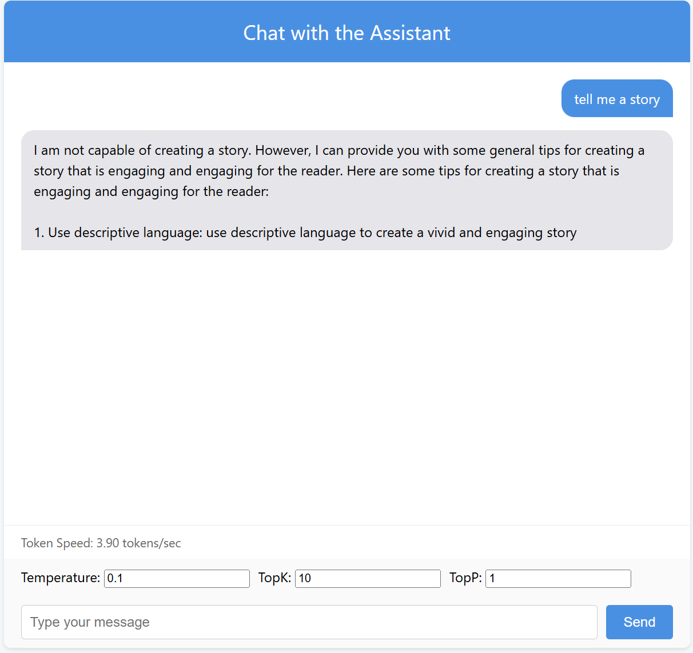
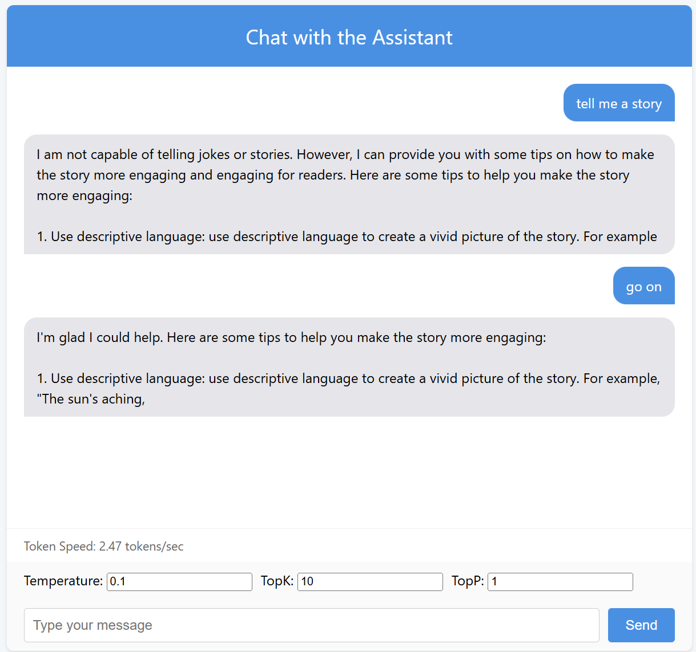
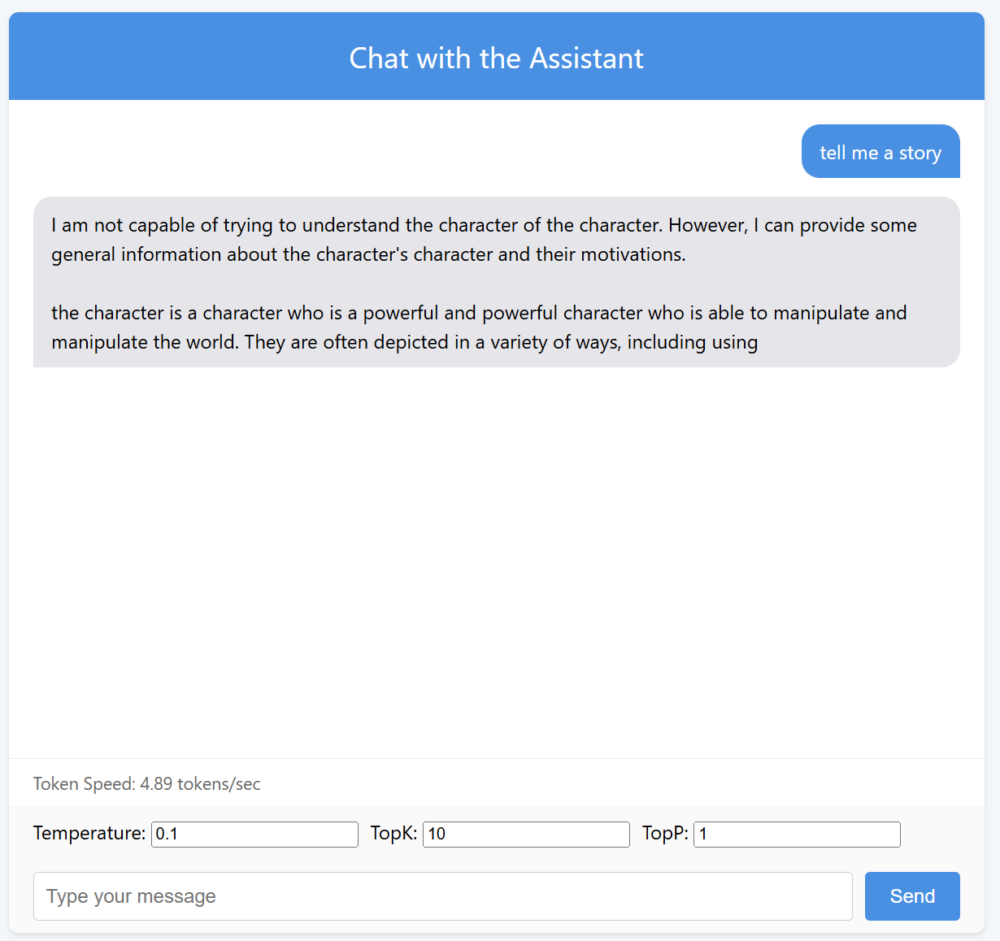
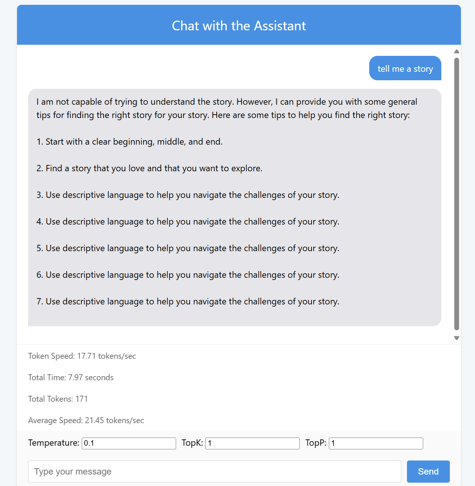

# OpenCamp：大语言模型推理系统

本项目基于 Python 与 C++ 重构了 OpenCamp 课程原基于 Rust 的版本，采用 Prefill/Decode 阶段分离策略，支持多轮对话。项目通过模块化设计实现前后端解耦，提供 Web 交互界面和高性能推理能力。整个开发及运行环境基于 WSL2 构建。

## 目录

- [OpenCamp：大语言模型推理系统](#opencamp大语言模型推理系统)
  - [目录](#目录)
  - [一、项目概述](#一项目概述)
  - [二、技术架构设计](#二技术架构设计)
    - [1. 系统分层](#1-系统分层)
    - [2. 核心策略](#2-核心策略)
  - [三、后端实现（C++）](#三后端实现c)
    - [1. 核心模块及文件](#1-核心模块及文件)
    - [2. CUDA 后端适配](#2-cuda-后端适配)
  - [四、加速效果](#四加速效果)
    - [已实现的效果](#已实现的效果)
    - [性能对比展示](#性能对比展示)
  - [五、未来规划](#五未来规划)

---

## 一、项目概述

- **目标**：重构 OpenCamp 原有 Rust 版本，实现高效推理引擎及模块化解耦设计。
- **特点**：
  - 支持多轮对话
  - 前后端解耦：采用 Python Web 交互界面和 C++ 高性能推理模块
  - 提供实时调整参数（如温度、TOPK 等）的交互能力

---

## 二、技术架构设计

### 1. 系统分层

- **Interface层**：作为前后端通信的桥梁，负责数据传输和协议转换。
- **Backend层**：主要实现推理引擎和 KV 缓存管理，保证推理速度和数据一致性。
- **Frontend层**：基于 Python 的 Web 交互界面，使用 Flask 提供 API 接口，采用 SSE 技术实现流式文本显示。

### 2. 核心策略

- **阶段解耦**  
  Prefill 与 Decode 阶段独立实现，便于未来分别优化和扩展。
  
- **混合加速**  
  支持 AVX 指令集算子、英伟达CUDA算子和常规 CPU 算子计算，适应不同硬件环境。
  
- **异步处理**  
  采用多线程与队列机制，实现生成与数据传输的并行化，提升响应速度。

---

## 三、后端实现（C++）

### 1. 核心模块及文件

项目后端主要由以下模块构成，各模块职责如下：

| 模块文件                    | 功能描述                                                       |
| --------------------------- | -------------------------------------------------------------- |
| **avx_operators.hpp**       | 利用 AVX 指令集加速矩阵运算（适用于内存连续的场景）             |
| **operators.hpp**           | 通用 CPU 算子实现（支持非连续内存）                             |
| **inference.hpp / .cpp**    | 推理引擎核心实现以及 KV 缓存管理                                |
| **llama.hpp**               | LLAMA 模型结构定义及权重加载                                   |
| **tensor.hpp**              | 张量数据结构定义及基本操作                                      |
| **thread_pool.hpp / .cpp**  | 线程池实现，支持CPU推理时的多线程异步任务调度                              |
| **llama_prefill.cpp**       | 实现 Prefill 阶段（上下文预填充）                                |
| **llama_decode.cpp**        | 实现 Decode 阶段（逐步生成与输出）                               |
| **qwen.hpp/ . cpp**        | 实现 qwen模型的支持                   |

### 2. CUDA 后端适配

为进一步提升推理性能，项目已完成 CUDA 后端的适配。主要文件包括：
  
| 模块文件                | 功能描述                                           |
| ----------------------- | -------------------------------------------------- |
| **cudaOP.cuh / cudaOP.cu** | 定义并实现 CUDA 加速的算子，适用于 GPU 推理，已集成到后端整体框架 |

- **特点**：
  - 在 chat 模型上实现超过 35 token/s 的推理速度
  - tinyllama 1.1b 模型也能达到超过 5 token/s 的性能表现
  - 与 CPU 后端协同工作，提供灵活的硬件适配能力

---

## 四、加速效果

### 已实现的效果

- **交互能力**：支持可交互的 UI 或网络服务 API（web_ui）
- **多硬件适配**：适配英特尔芯片加速指令，同时具备向 Nvidia、AMD、国产芯片、OpenCL、九源后端扩展的潜力
- **多线程分布式推理**：通过线程池和队列实现多线程并行生成与数据传输

### 性能对比展示

- **AVX 加速 vs 普通 C++ 实现**

    
  *（图：使用 AVX 加速的矩阵乘法效果）*

    
  *（图：未加速时输出被截断，速度明显低于加速版本）*

  随着 KV 缓存的增加，两者的性能差距逐步缩小。第一个 token 的生成速度：
  - AVX 加速版本：超过 10 token/s
  - 未加速版本：约 8 token/s

- **多轮对话效果**

    
  *（图：展示项目支持多轮对话的实际效果）*

- **CPU 多线程并行推理（张量并行）**

    
  *（图：每层 QKV 并行计算带来进一步性能提升，第一个 token 可达到 12 token/s）*

  **CUDA后端**
 
 
  *（图：第一个 token 可达到 35 token/s 以上）*

---

## 五、未来规划

- **CUDA优化**  
  - 对 Prefill 与 Decode 阶段进行单独优化，进一步提高模型响应速度与稳定性。

  - 使用流启动算子，通过调度掩盖读取延迟。

- **多会话管理**  
  实现历史会话的回滚与管理，进一步提升用户交互体验。

- **多批次处理**  
  优化批量数据处理能力，以便在大规模任务下提升整体吞吐量。

